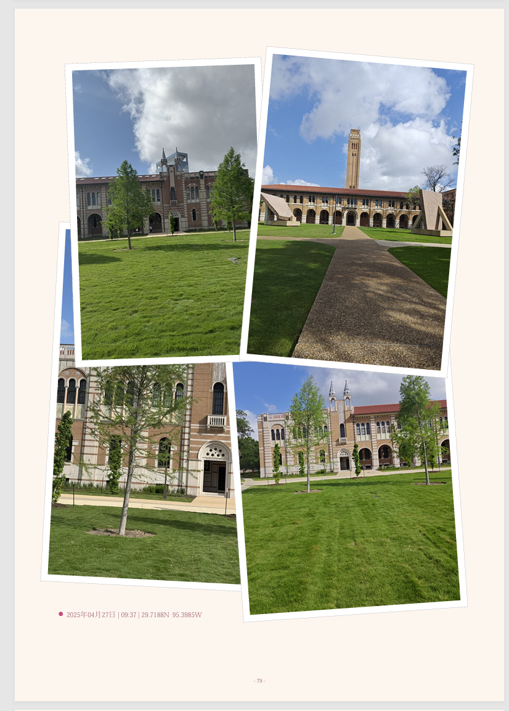
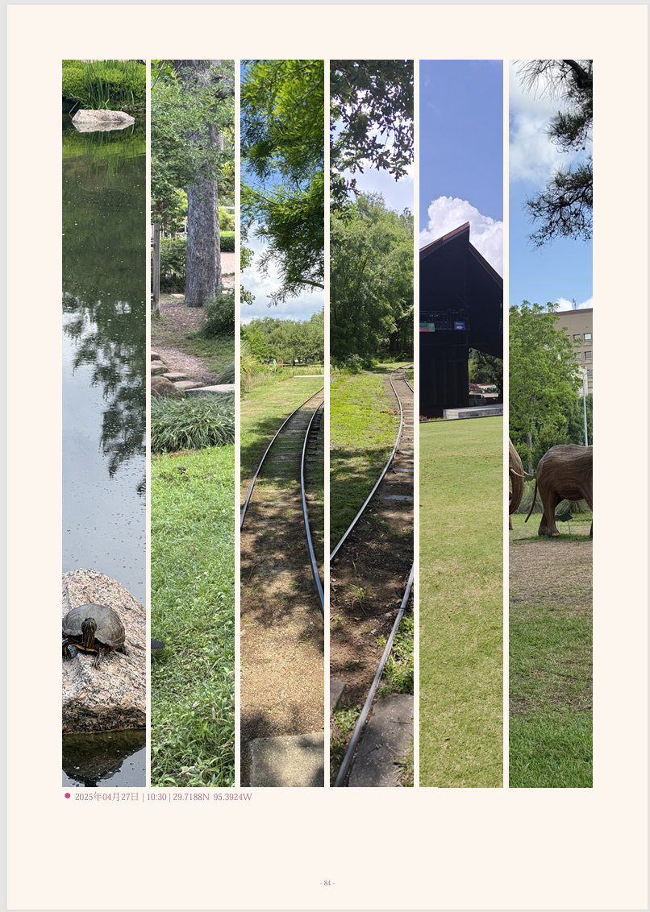
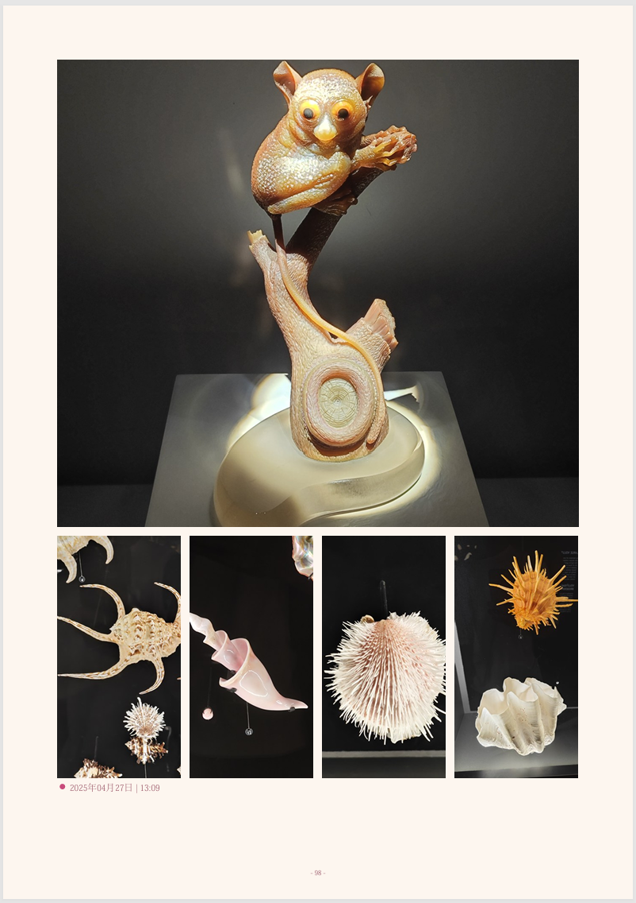
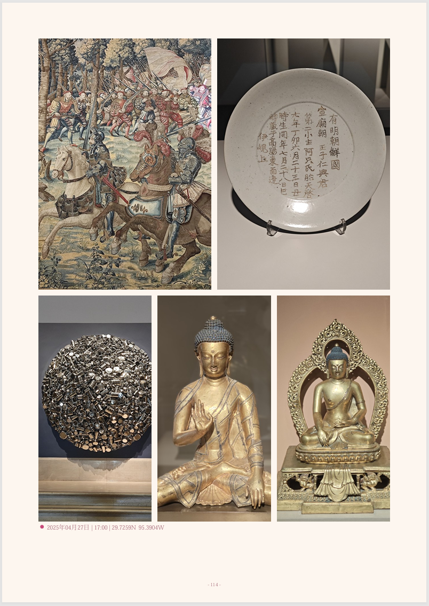
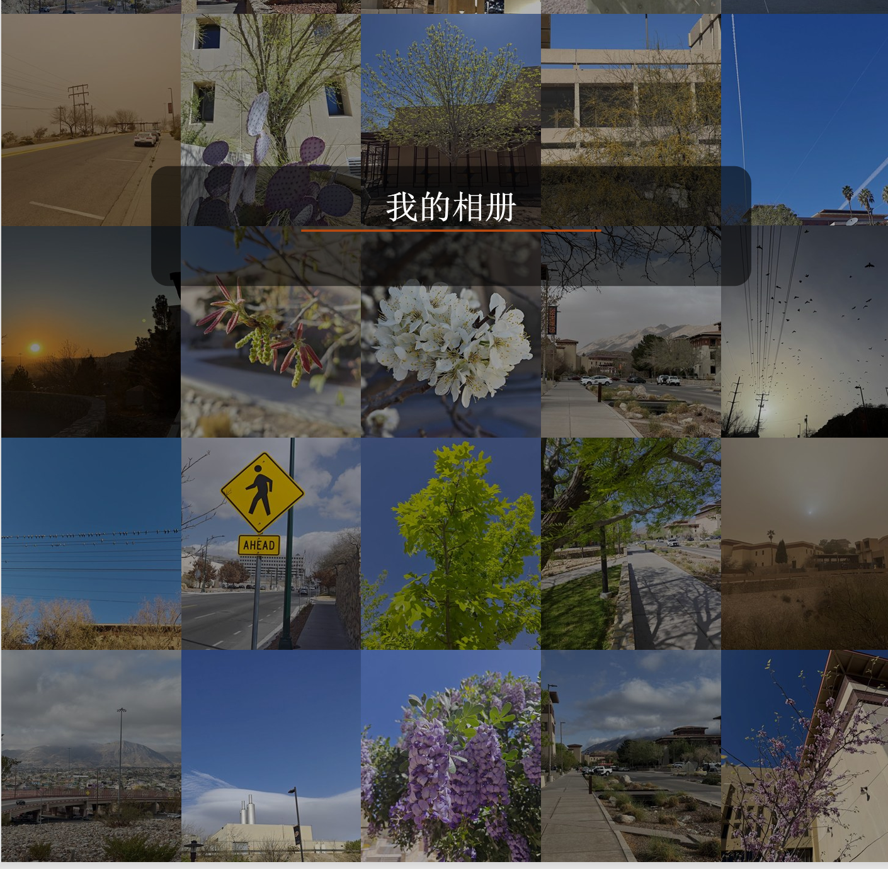

# EverAlbum
This is an automatic album generator that organizes your own photos, especially suitable for large collections of 1,000–5,000 images. It intelligently clusters photos by month and visual style similarity, then creates beautifully arranged albums using more than 40 different photo layout styles.  **Note:** The original interface is in Chinese. 
----------------------------------------------------------------------------------------------------------------------------------------
EverAlbum is a smart album generation project with a `tkinter` interface. It currently consists of two main tracks:
- **Album Main Program**: Aggregates photos by timeline and location to generate an A4 `PDF`, with an optional export to `PPTX`.
- **Portrait Background Remover**: Uses `rembg` to remove backgrounds from selected portraits and saves the transparent PNGs to the album asset library for use as overlays on chapter pages.


Automatically generate beautiful photo albums from thousands of personal photos.

The generator automatically:

📅 Clusters photos by month and event

🎨 Groups photos by visual similarity

🖼️ Supports 40+ album layout styles

📖 Automatically generates chapter pages and back covers

Features

Automatic photo clustering
Timeline-based organization
Style similarity analysis
40+ professionally designed layouts
Automatic chapter pages
Automatic back cover generation
Chinese interface (English version coming soon)

## Directory Structure
```text
EverAlbum/
├─ photo_album_generator pro.py          # Main program compatibility launcher
├─ portrait_bg_remover.py                # Background remover tool compatibility launcher
├─ everalbum/
│  ├─ __init__.py
│  ├─ album_app.py                       # Album scanning, clustering, narrative, PDF/PPTX building, GUI
│  ├─ portrait_app.py                    # Portrait background removal GUI
│  └─ services/
│     ├─ config.py                       # AlbumBuildRequest configuration data model
│     ├─ narrative_engine.py             # Chapter copy / tab copy generation
│     ├─ portrait_assets.py              # Portrait asset library and manifest
│     ├─ portrait_removal.py             # rembg wrapper
│     └─ workspace.py                    # Workspace root directory / default asset library path
├─ portrait_elements/                    # Default portrait asset library (auto-created after running)
└─ SKILL.md                              # Skill document for future maintenance

---------------------------------------------------------------------------------------------
## 📸 Examples

### Example 1



### Example 2



### Example 3



### Example 4



### Chapter Page


### Back Cover


